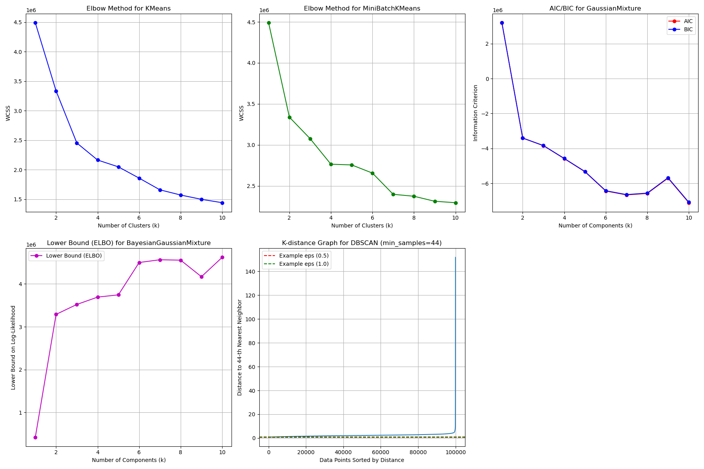

# Hospital Length of Stay Data Mining

This repository contains a group project for the Data Mining class of the Data Science MSc program at the International Hellenic University. The project explores data mining methodologies and algorithms on a real-world healthcare dataset to discover patterns and extract knowledge.

## Project Context

- **Course:** Data Mining (MSc in Data Science)
- **Institution:** International Hellenic University
- **Type:** Group Assignment

## Dataset

We used the [Hospital Length of Stay Dataset](https://www.kaggle.com/datasets/aayushchou/hospital-length-of-stay-dataset-microsoft/data) from Kaggle, which contains 100,000 rows and 28 features related to patient demographics, diagnoses, and hospital stay details.

## Methodology

- **Exploratory Data Analysis:** Distribution of length of stay, gender, and readmissions.
- **Feature Engineering:** Creation of new features such as "number of issues".
- **Clustering:** KMeans, MiniBatchKMeans, DBSCAN, Gaussian Mixture, Bayesian Gaussian Mixture. Evaluation with Elbow Method, AIC/BIC, silhouette score, and more.
- **Regression:** Linear Regression, Elastic Net, Decision Trees, Random Forest, Gradient Boosting, AdaBoost, XGBoost, KNN.
- **Classification:** MLP, Random Forest.
- **Model Evaluation:** Cross-validation, RMSE, R², accuracy, feature importance.

## Results & Discussion

- **Clustering:** KMeans performed best, revealing two main patient groups.
- **Regression:** XGBoost achieved the highest R² and lowest RMSE for predicting length of stay.
- **Classification:** Performed less well due to the wide range of target classes.
- **Feature Importance:** Readmission count and biometric indicators were most predictive.
